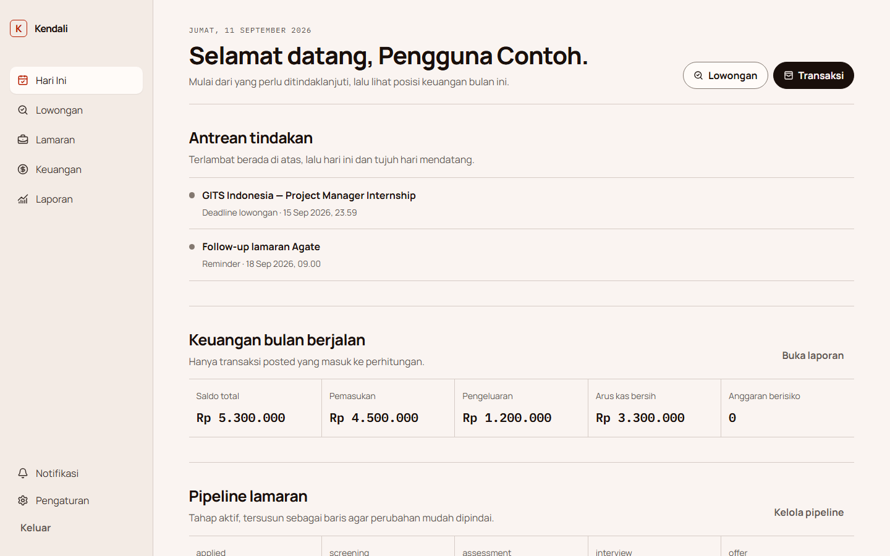
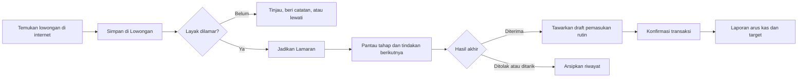
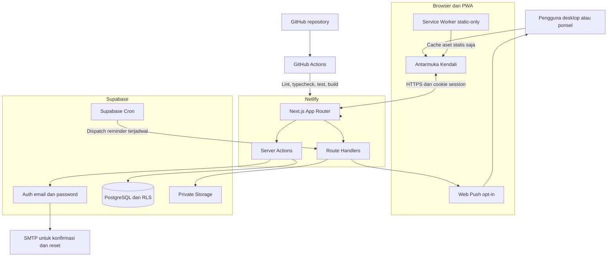

<div align="center">
  
  <h1>Kendali</h1>
  <p><strong>Ruang kerja personal untuk mengelola perjalanan karier dan keuangan dalam satu alur yang tenang</strong></p>
  <p>Catat peluang kerja, pantau setiap lamaran, kelola arus kas, dan lihat tindakan terpenting hari ini tanpa berpindah-pindah aplikasi.</p>

  <p>
    <a href="https://github.com/bangaji313/kendali-job-finance-tracker/actions/workflows/ci.yml"></a>
    
    
    
    
    
    
  </p>
</div>

---

## Daftar isi

- [Tentang Kendali](#tentang-kendali)
- [Penjelasan non-teknis](#penjelasan-non-teknis)
- [Fitur utama](#fitur-utama)
- [Tampilan aplikasi](#tampilan-aplikasi)
- [Alur penggunaan](#alur-penggunaan)
- [Penjelasan teknis](#penjelasan-teknis)
- [Arsitektur end-to-end](#arsitektur-end-to-end)
- [Teknologi](#teknologi)
- [Keamanan dan privasi](#keamanan-dan-privasi)
- [Menjalankan di komputer lokal](#menjalankan-di-komputer-lokal)
- [Variabel lingkungan](#variabel-lingkungan)
- [Pengujian](#pengujian)
- [Publikasi](#publikasi)
- [Struktur proyek](#struktur-proyek)
- [Dokumentasi](#dokumentasi)
- [Status dan batas MVP](#status-dan-batas-mvp)
- [Pemilik proyek](#pemilik-proyek)

## Tentang Kendali

Kendali adalah aplikasi web personal-first yang menyatukan dua hal yang sering berjalan terpisah: pencarian kerja dan pengelolaan uang. Aplikasi ini dirancang untuk membantu pengguna mengambil keputusan berikutnya dengan data yang rapi, bukan sekadar mengumpulkan catatan.

Halaman **Hari Ini** menjadi pusat perhatian. Deadline lowongan, tindak lanjut lamaran, posisi pipeline, saldo, arus kas, dan anggaran yang perlu diperhatikan ditampilkan dalam satu ruang kerja. Antarmuka menggunakan Bahasa Indonesia, zona waktu awal `Asia/Jakarta`, dan mata uang awal IDR.

## Penjelasan non-teknis

Bayangkan Kendali sebagai meja kerja pribadi dengan dua laci yang saling terhubung:

1. **Laci karier** menyimpan lowongan dari internet, alamat resmi untuk melamar, deadline, catatan kecocokan, serta perkembangan setelah lamaran dikirim.
2. **Laci keuangan** menyimpan akun uang, pemasukan, pengeluaran, transfer, anggaran bulanan, dan target tabungan.

Ketika sebuah lamaran diterima, Kendali dapat menawarkan pembuatan rancangan pemasukan rutin. Pengguna tetap memeriksa dan menyetujuinya terlebih dahulu; aplikasi tidak mengubah data keuangan secara otomatis.

Setiap pengguna memiliki ruang data sendiri. Data lowongan, lamaran, dokumen, dan transaksi pengguna lain tidak dapat dilihat hanya karena sama-sama memiliki akun Kendali.

## Fitur utama

### Hari Ini

- Antrean tindakan yang mengutamakan item terlambat dan deadline terdekat.
- Ringkasan pipeline lamaran serta kondisi keuangan bulan berjalan.
- Akses cepat untuk mencatat lowongan, lamaran, dan transaksi.

### Lowongan dan lamaran

- Inbox lowongan dari internet dengan tautan sumber dan laman resmi untuk melamar.
- Filter program, status, deadline, perusahaan, posisi, dan lokasi.
- Timeline seleksi dan deadline yang dapat dilengkapi secara manual.
- Konversi satu langkah dari lowongan menjadi lamaran tanpa membuat data ganda.
- Pipeline lamaran dari Tersimpan hingga Diterima, Ditolak, Ditarik, atau Diarsipkan.
- Riwayat perubahan tahap, tindakan berikutnya, kontak, label, catatan, dan lampiran private.

### Keuangan

- Akun kas, bank, e-wallet, dan akun lain dengan saldo awal.
- Pemasukan, pengeluaran, transfer, serta transaksi rutin berbentuk draft.
- Anggaran bulanan per kategori pengeluaran.
- Target tabungan dan riwayat kontribusi.
- Laporan arus kas; hanya transaksi berstatus **Diposting** yang memengaruhi angka.

### Data dan notifikasi

- Impor CSV dengan pratinjau, deteksi duplikat, dan kesalahan per baris.
- Ekspor CSV per modul serta JSON untuk seluruh data terstruktur.
- Reminder di dalam aplikasi dan Web Push yang harus diaktifkan pengguna.
- PWA yang dapat dipasang pada desktop atau ponsel.

## Tampilan aplikasi



<p align="center"><em>Halaman Hari Ini menyatukan tindakan lamaran, ringkasan pipeline, dan kondisi keuangan bulan berjalan. Data pada gambar merupakan data demonstrasi, bukan data pribadi pengguna.</em></p>

Desain Kendali mengikuti pendekatan modern-minimal dengan warna kertas hangat, tinta gelap, dan aksen coral yang digunakan seperlunya. Tata letaknya mengutamakan keterbacaan, navigasi singkat, serta tabel padat di desktop yang berubah menjadi daftar terstruktur di ponsel.

## Alur penggunaan



## Penjelasan teknis

Kendali dibangun sebagai aplikasi Next.js App Router dengan TypeScript strict. Server Components menangani pembacaan data secara default, sedangkan Server Actions menangani perubahan data dari antarmuka. Route Handlers dibatasi untuk callback autentikasi, impor, ekspor, upload dokumen, dan dispatch reminder.

Supabase menyediakan PostgreSQL, Auth, private Storage, dan scheduler. Validasi masukan menggunakan Zod pada batas server dan client, kemudian diperkuat oleh constraint database. Seluruh tabel milik pengguna memakai `user_id` dan Row Level Security agar kepemilikan data diperiksa kembali di lapisan database.

Perhitungan keuangan tidak menggunakan floating point. Nilai disimpan sebagai `numeric(18,2)` di PostgreSQL dan diproses sebagai satuan sen pada domain TypeScript. Transfer harus memakai dua akun berbeda dan tidak mengubah total kekayaan lintas akun.

## Arsitektur end-to-end



Data finansial, HTML halaman yang telah login, dan respons API tidak disimpan oleh service worker. Kendali tidak menyediakan perubahan data secara offline pada MVP.

## Teknologi

| Bagian | Teknologi | Peran |
| --- | --- | --- |
| Aplikasi web | Next.js 16.3, React 19.2 | Routing, rendering server, dan antarmuka |
| Bahasa | TypeScript 5.9 strict | Kontrak tipe dan keamanan perubahan kode |
| Tampilan | Tailwind CSS 4.3, CSS tokens, Lucide | Tata letak, design system, dan ikon |
| Backend | Supabase, PostgreSQL | Database, autentikasi, storage, dan cron |
| Validasi | Zod 4.5 | Validasi form dan batas sistem |
| PWA | Web App Manifest, Service Worker, Web Push | Instalasi dan reminder perangkat |
| Unit test | Vitest 5 | Logika domain dan parser |
| End-to-end | Playwright 1.63 | Alur pengguna dan tampilan responsif |
| Hosting | Netlify | Build, deploy preview, dan production |

Seluruh dependency dipin pada versi pasti dan lockfile pnpm disimpan di repository agar instalasi dapat diulang secara konsisten.

## Keamanan dan privasi

- Login menggunakan email dan password Supabase dengan konfirmasi email.
- Secret Supabase, private VAPID key, dan scheduler secret hanya digunakan di server.
- Row Level Security membatasi setiap operasi berdasarkan pemilik data.
- Lampiran disimpan pada bucket private dan dibuka melalui signed URL berumur singkat.
- MIME type, ekstensi, ukuran, dan kepemilikan file diperiksa kembali di server.
- Service worker hanya menyimpan aset statis dan halaman fallback offline.
- Log aplikasi tidak boleh berisi nominal transaksi, catatan pribadi, token, email lengkap, atau nama dokumen.
- `.env.local`, state lokal layanan, hasil build, laporan pengujian, dan metadata IDE tidak masuk ke Git.

> [!IMPORTANT]
> Jangan pernah menaruh nilai asli `SUPABASE_SECRET_KEY`, `VAPID_PRIVATE_KEY`, atau `REMINDER_DISPATCH_SECRET` di README, source code, issue, screenshot, maupun log publik.

## Menjalankan di komputer lokal

### Prasyarat

- Node.js 24 LTS
- pnpm 11.19.0
- Docker Desktop
- Supabase CLI

### Langkah

```bash
pnpm install --frozen-lockfile
copy .env.example .env.local
pnpm dlx supabase start
pnpm dev
```

Buka `http://localhost:3000`. Salin konfigurasi lokal dari `supabase status` ke `.env.local`, lalu buat akun melalui `/daftar`. Email pengembangan lokal dapat diperiksa melalui Mailpit di `http://127.0.0.1:54324`.

Jika variabel Supabase belum tersedia, antarmuka berjalan sebagai pratinjau kosong dan tidak membuat data atau angka contoh secara otomatis.

## Variabel lingkungan

Salin `.env.example` menjadi `.env.local`, kemudian isi nilainya secara lokal. Daftar berikut hanya menjelaskan fungsinya dan tidak boleh diisi langsung di repository.

| Variabel | Kebutuhan | Keterangan |
| --- | --- | --- |
| `NEXT_PUBLIC_SUPABASE_URL` | Wajib | URL project Supabase |
| `NEXT_PUBLIC_SUPABASE_PUBLISHABLE_KEY` | Wajib | Publishable key untuk browser |
| `SUPABASE_SECRET_KEY` | Wajib | Secret server; tidak boleh memakai prefix `NEXT_PUBLIC_` |
| `NEXT_PUBLIC_SITE_URL` | Wajib | URL aplikasi lokal atau production |
| `INITIAL_ADMIN_EMAIL` | Wajib | Email yang memperoleh peran admin awal |
| `NEXT_PUBLIC_VAPID_PUBLIC_KEY` | Opsional | Public key untuk Web Push |
| `VAPID_PRIVATE_KEY` | Opsional | Private key Web Push, server-only |
| `VAPID_SUBJECT` | Opsional | Identitas kontak pengirim push |
| `REMINDER_DISPATCH_SECRET` | Opsional | Secret endpoint scheduler reminder |

## Pengujian

Jalankan seluruh pemeriksaan utama:

```bash
pnpm verify
```

Perintah tersebut menjalankan lint, typecheck, unit test, dan production build secara berurutan. Pengujian browser dapat dijalankan terpisah:

```bash
pnpm test:e2e
```

Area yang diuji meliputi perhitungan saldo, transfer, anggaran, tanggal berulang, perubahan tahap lamaran, parsing CSV, autentikasi, CRUD, impor atomik, tampilan responsif, serta alur Lowongan menjadi Lamaran.

## Publikasi

Target production adalah Netlify untuk aplikasi dan Supabase untuk backend. Repository dapat dihubungkan langsung dari dashboard Netlify; konfigurasi build, versi Node, dan versi pnpm sudah tersedia di [`netlify.toml`](netlify.toml).

Urutan ringkas:

1. Terapkan migrasi dalam [`supabase/migrations`](supabase/migrations) ke project Supabase tujuan.
2. Aktifkan Email + Password, konfirmasi email, custom SMTP, dan redirect URL production.
3. Hubungkan repository ini ke Netlify.
4. Tambahkan variabel lingkungan melalui dashboard Netlify, bukan melalui file di GitHub.
5. Uji pendaftaran, login, Lowongan, Lamaran, Keuangan, ekspor, dan reset password dari domain production.

Panduan bergambar tersedia dalam [`docs/panduan/Panduan_Kendali_Publikasi_dan_Penggunaan.pdf`](docs/panduan/Panduan_Kendali_Publikasi_dan_Penggunaan.pdf).

## Struktur proyek

```text
Job&Finance_Tracker/
├── .github/workflows/     # Pemeriksaan otomatis
├── data/                  # Data impor terkurasi tanpa credential
├── docs/                  # Arsitektur, model data, deploy, dan panduan
├── public/                # Ikon, service worker, dan template CSV
├── scripts/               # Utilitas impor dan dokumentasi
├── src/
│   ├── app/               # Halaman, actions, dan route handlers
│   ├── components/        # Form, navigation, dan UI domain
│   └── lib/               # Domain, validasi, data access, dan Supabase
├── supabase/
│   ├── migrations/        # Schema, grants, RLS, storage, dan cron
│   └── templates/         # Email konfirmasi dan pemulihan
└── tests/                 # Unit dan end-to-end tests
```

## Dokumentasi

- [`PRD.md`](PRD.md) — tujuan produk, ruang lingkup MVP, UX, keamanan, dan acceptance criteria.
- [`docs/architecture.md`](docs/architecture.md) — keputusan arsitektur dan batas sistem.
- [`docs/data-model.md`](docs/data-model.md) — entitas, relasi, dan invariant data.
- [`docs/deploy-netlify-supabase.md`](docs/deploy-netlify-supabase.md) — checklist publikasi Netlify dan Supabase.
- [`docs/panduan/Panduan_Kendali_Publikasi_dan_Penggunaan.pdf`](docs/panduan/Panduan_Kendali_Publikasi_dan_Penggunaan.pdf) — panduan bergambar untuk pemilik dan pengguna.

## Status dan batas MVP

Fondasi MVP telah tersedia: autentikasi, Lowongan, Lamaran, Keuangan, laporan, impor/ekspor, private attachment, reminder, PWA, test suite, dan CI.

Fitur berikut belum menjadi bagian MVP: sinkronisasi bank, investasi, utang/cicilan, konversi mata uang otomatis, kolaborasi data, OCR, rekomendasi AI, aplikasi native, mutasi offline penuh, dan dark mode.

## Pemilik proyek

Kendali dikembangkan dan dipelihara oleh [bangaji313](https://github.com/bangaji313). Repository ini merupakan proyek personal; perubahan dan akses kolaborator dikelola langsung oleh pemilik repository.
