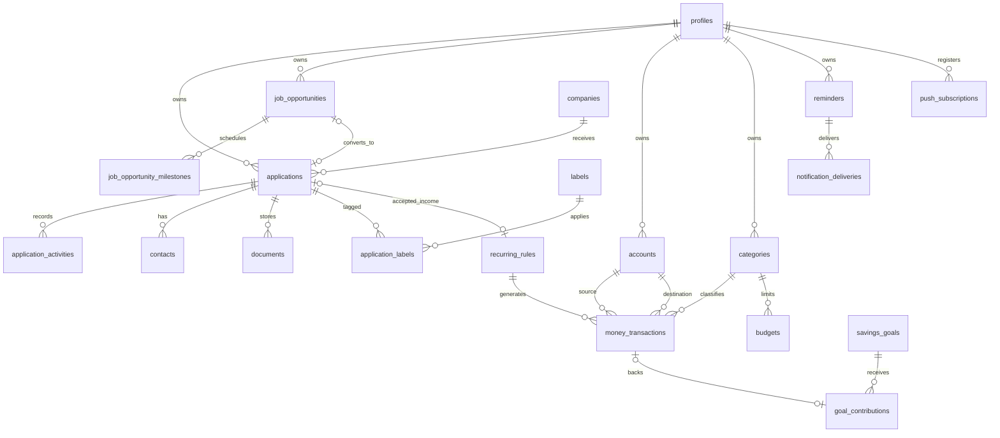

# Data model

## Invariants

- Every user-owned row contains `user_id`; ownership cannot be changed by clients.
- A job opportunity stores its official application URL, deadline, tracking status, and optional manual milestones before it becomes an application.
- One opportunity can be converted to at most one application; conversion preserves the original source reference.
- Application stage history is generated by a database trigger.
- Transfer source and destination are both present and different; income has destination only; expense has source only.
- Draft and void transactions have zero effect on reports.
- `(user_id, occurrence_key)` is unique for recurring drafts.
- One application can reference at most one recurring-income rule.
- Budget is unique per user, category, and month.
- Delivery idempotency key is globally unique.
- Attachment object path begins with the authenticated user UUID.
